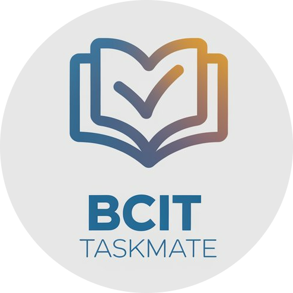

# **BCIT TaskMate** 📚✅



BCIT TaskMate is your ultimate companion for managing tasks and deadlines in the Full Stack Web Development (FSWD) program at BCIT. Stay organized, focused, and ahead of the game! 🚀

---

## ✨ **Features**

- 📝 **Create Tasks**: Easily add course-related or personal tasks.
- ⏰ **Set Deadlines**: Never miss an important due date again.
- 📊 **Task Overview**: Get a bird's-eye view of all your commitments.
- 📱 **Responsive Design**: Access your tasks anytime, anywhere.
- 🧭 **Intuitive Navigation**: Effortlessly manage your workload with a user-friendly interface.

---

## 🛠️ **Tech Stack**

- ⚛️ **React**: For dynamic UI components.
- 🧭 **React Router & TanStack Router**: Advanced routing capabilities.
- 🎨 **TailwindCSS**: For clean and responsive design.
- 📅 **Date-fns**: Simple and lightweight date handling.
- 🔣 **React Icons**: Beautiful icons to enhance the user interface.

---

## 🚀 **Getting Started**

Follow these steps to set up the app locally:

1. **Clone the repository**:

   ```bash
   git clone <repository-url>
   ```

2. **Navigate to the project folder**:

   ```bash
   cd fswd-taskmate
   ```

3. **Install dependencies**:

   ```bash
   npm install
   ```

4. **Launch the app**:

   ```bash
   npm start
   ```

   🌐 Visit [http://localhost:3000](http://localhost:3000) in your browser to access the app.

---

## 📱 **App Sections**

| **Section**        | **Description**                            |
| ------------------ | ------------------------------------------ |
| 🏠 **Home**        | Quick feature overview.                    |
| ℹ️ **About**       | Learn about BCIT TaskMate and its purpose. |
| 📋 **Tasks**       | View and manage your list of tasks.        |
| ➕ **Create Task** | Add new tasks to your schedule.            |

---

## 🙏 **Acknowledgements**

BCIT TaskMate would not have been possible without the support and guidance of:

- **BCIT's Full Stack Web Development (FSWD) Program**: Providing the knowledge and inspiration to build this app.
- **Our Beta Testers**: Your feedback made this app better.
- **Collaborators & Mentors**: Thank you for your insights and technical support.
- **You**: For using BCIT TaskMate and being part of our journey.

---

## ❤️ Built By

**FSWD Students, for FSWD Students**  
Dedicated to simplifying your academic and personal task management.

Feel free to suggest updates or improvements by submitting a pull request. Your contributions are always welcome!

---
